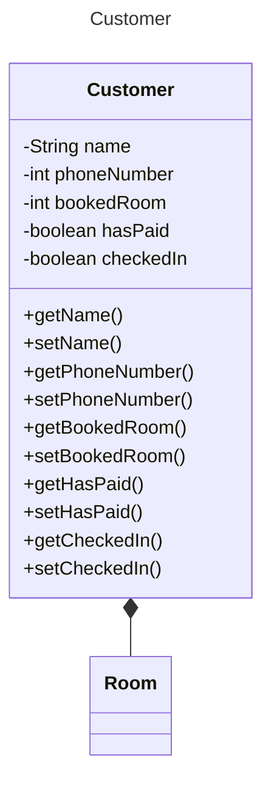

```mermaid
---
title: Customer
---
classDiagram
    Customer *-- Room
    class Customer {
        -String name
        -int phoneNumber
        -int bookedRoom
        -boolean hasPaid
        -boolean checkedIn
        +getName()
        +setName()
        +getPhoneNumber()
        +setPhoneNumber()
        +getBookedRoom()
        +setBookedRoom()
        +getHasPaid()
        +setHasPaid()
        +getCheckedIn()
        +setCheckedIn()
    }
```
