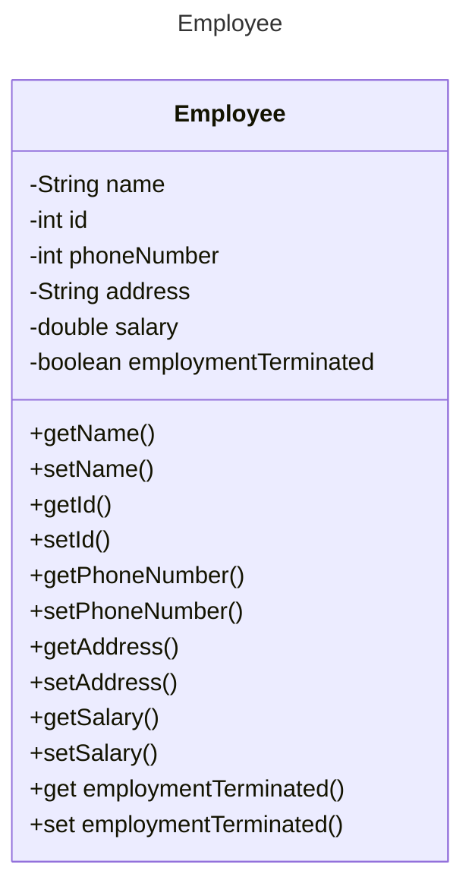

```mermaid
---
title: Employee
---
classDiagram
    class Employee {
        -String name
        -int id
        -int phoneNumber
        -String address
        -double salary
        -boolean employmentTerminated
        +getName()
        +setName()
        +getId()
        +setId()
        +getPhoneNumber()
        +setPhoneNumber()
        +getAddress()
        +setAddress()
        +getSalary()
        +setSalary()
        +get employmentTerminated()
        +set employmentTerminated()
    }
```