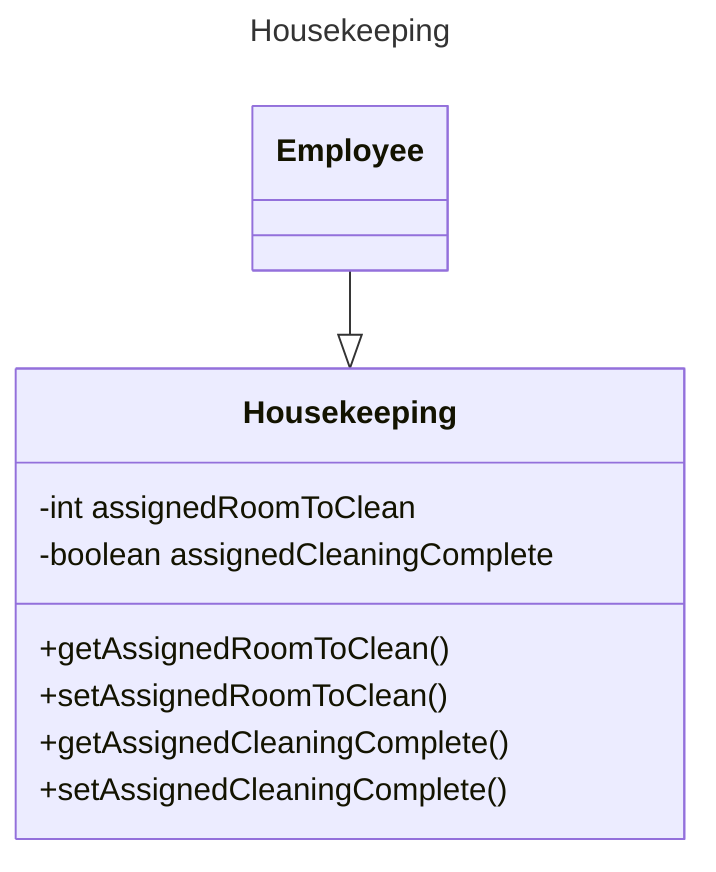

```mermaid
---
title: Housekeeping
---
classDiagram
    Employee --|> Housekeeping
    class Housekeeping {
        -int assignedRoomToClean
        -boolean assignedCleaningComplete
        +getAssignedRoomToClean()
        +setAssignedRoomToClean()
        +getAssignedCleaningComplete()
        +setAssignedCleaningComplete()
    }
```