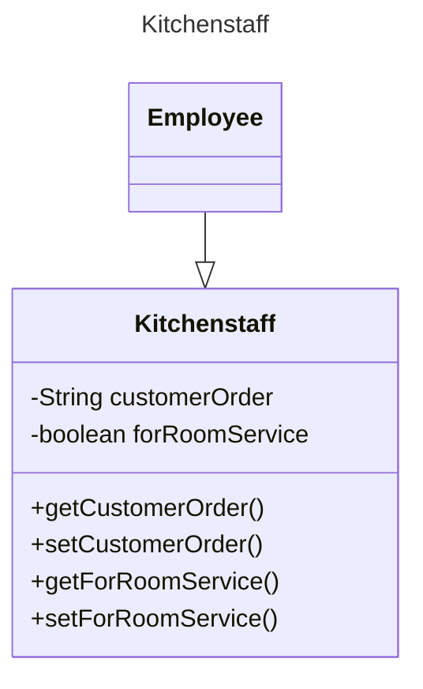

```mermaid
---
title: Kitchenstaff
---
classDiagram
    Employee --|> Kitchenstaff
    class Kitchenstaff {
        -String customerOrder
        -boolean forRoomService
        +getCustomerOrder()
        +setCustomerOrder()
        +getForRoomService()
        +setForRoomService()
    }
```