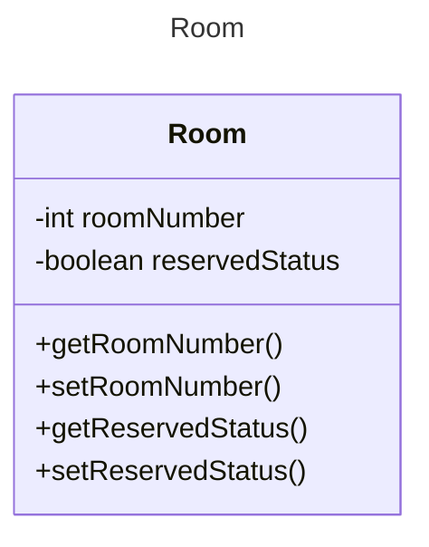

```mermaid
---
title: Room
---
classDiagram
  class Room {
    -int roomNumber
    -boolean reservedStatus
    +getRoomNumber()
    +setRoomNumber()
    +getReservedStatus()
    +setReservedStatus()
  }
```
