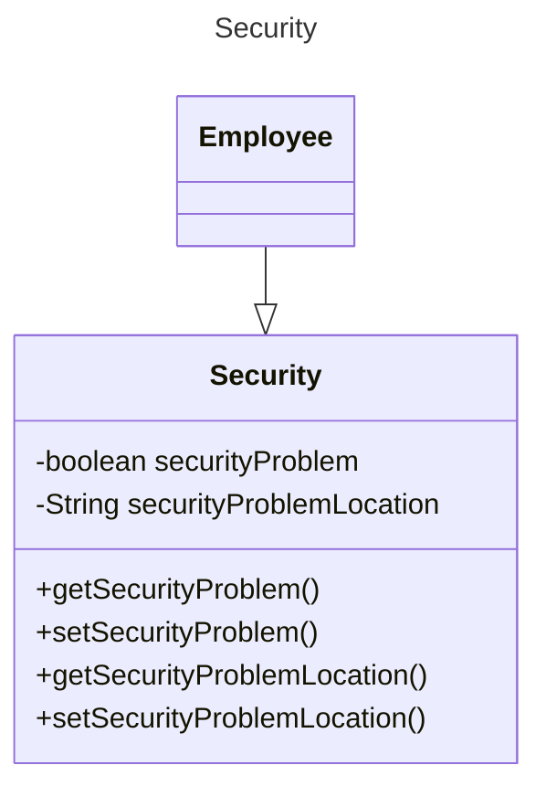

```mermaid
---
title: Security
---
classDiagram
    Employee --|> Security
    class Security {
        -boolean securityProblem
        -String securityProblemLocation
        +getSecurityProblem()
        +setSecurityProblem()
        +getSecurityProblemLocation()
        +setSecurityProblemLocation()
    }
```