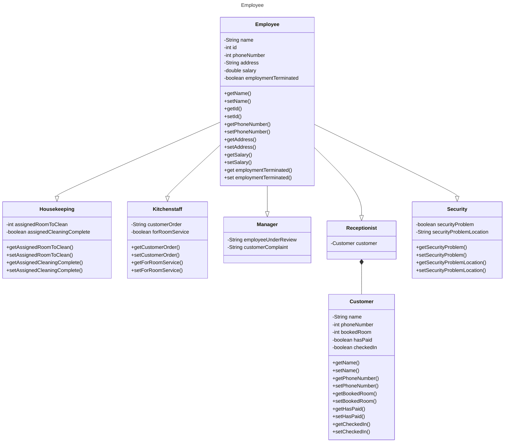

```mermaid
---
title: Employee
---
classDiagram
    class Employee {
        -String name
        -int id
        -int phoneNumber
        -String address
        -double salary
        -boolean employmentTerminated
        +getName()
        +setName()
        +getId()
        +setId()
        +getPhoneNumber()
        +setPhoneNumber()
        +getAddress()
        +setAddress()
        +getSalary()
        +setSalary()
        +get employmentTerminated()
        +set employmentTerminated()
    }

    Employee --|> Housekeeping
    class Housekeeping {
        -int assignedRoomToClean
        -boolean assignedCleaningComplete
        +getAssignedRoomToClean()
        +setAssignedRoomToClean()
        +getAssignedCleaningComplete()
        +setAssignedCleaningComplete()
    }

    Employee --|> Kitchenstaff
    class Kitchenstaff {
        -String customerOrder
        -boolean forRoomService
        +getCustomerOrder()
        +setCustomerOrder()
        +getForRoomService()
        +setForRoomService()
    }

    Employee --|> Manager
    class Manager {
        -String employeeUnderReview
        -String customerComplaint
    }

    Employee --|> Receptionist
    Receptionist *-- Customer
    class Receptionist {
        -Customer customer
    }

    Employee --|> Security
    class Security {
        -boolean securityProblem
        -String securityProblemLocation
        +getSecurityProblem()
        +setSecurityProblem()
        +getSecurityProblemLocation()
        +setSecurityProblemLocation()
    }

    class Customer {
        -String name
        -int phoneNumber
        -int bookedRoom
        -boolean hasPaid
        -boolean checkedIn
        +getName()
        +setName()
        +getPhoneNumber()
        +setPhoneNumber()
        +getBookedRoom()
        +setBookedRoom()
        +getHasPaid()
        +setHasPaid()
        +getCheckedIn()
        +setCheckedIn()
    }
```