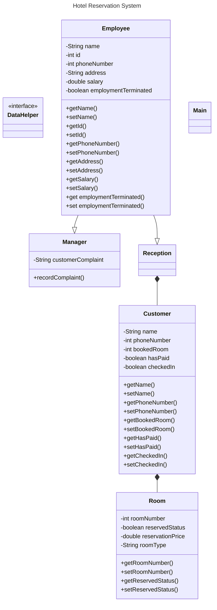

```mermaid
---
title: Hotel Reservation System
---

classDiagram
    Customer *-- Room
    class Customer {
        -String name
        -int phoneNumber
        -int bookedRoom
        -boolean hasPaid
        -boolean checkedIn
        +getName()
        +setName()
        +getPhoneNumber()
        +setPhoneNumber()
        +getBookedRoom()
        +setBookedRoom()
        +getHasPaid()
        +setHasPaid()
        +getCheckedIn()
        +setCheckedIn()
    }

    class DataHelper
    <<interface>> DataHelper
    

    class Employee {
        -String name
        -int id
        -int phoneNumber
        -String address
        -double salary
        -boolean employmentTerminated
        +getName()
        +setName()
        +getId()
        +setId()
        +getPhoneNumber()
        +setPhoneNumber()
        +getAddress()
        +setAddress()
        +getSalary()
        +setSalary()
        +get employmentTerminated()
        +set employmentTerminated()
    }

    class Main {
    }

    Employee --|> Manager
    class Manager {
        -String customerComplaint
        +recordComplaint()
    }


    Employee --|> Reception
    Reception *-- Customer
    class Reception {
        
    }

    class Room {
        -int roomNumber
        -boolean reservedStatus
        -double reservationPrice
        -String roomType
        +getRoomNumber()
        +setRoomNumber()
        +getReservedStatus()
        +setReservedStatus()
    }
```
