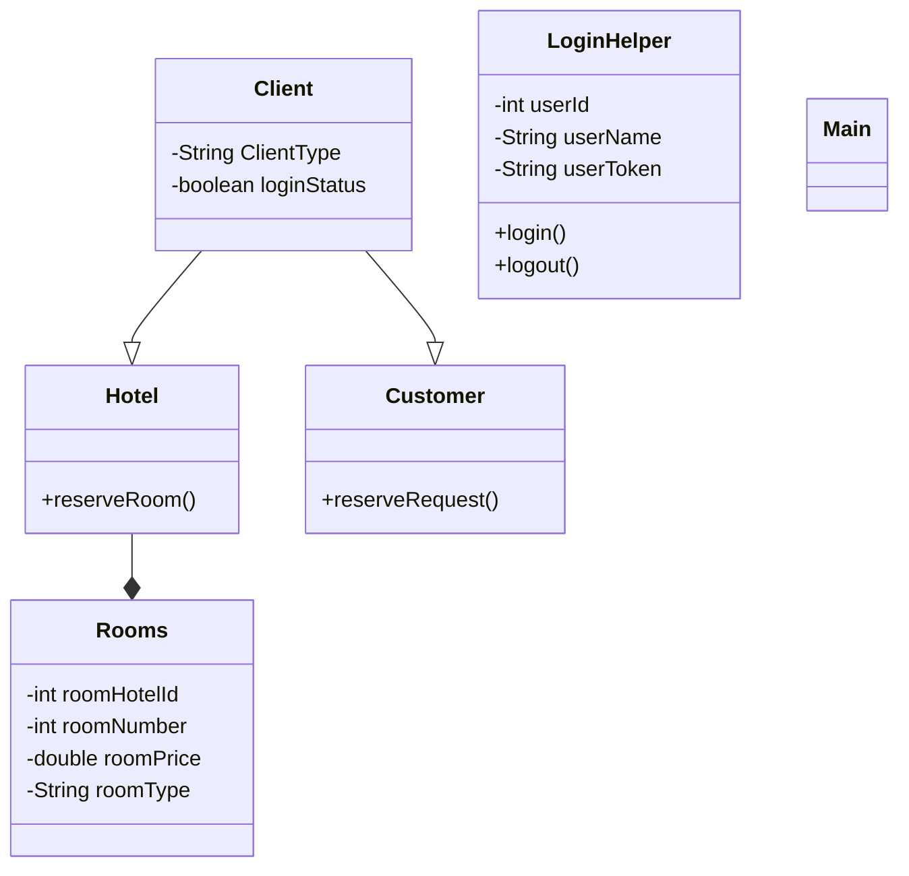

```mermaid
---
Title: Hotel Reservation System
---
classDiagram
    class Client {
        -String ClientType
        -boolean loginStatus
    }

    Client --|> Hotel
    class Hotel {
        +reserveRoom()
    }

    Client --|> Customer
    class Customer {
        +reserveRequest()
    }

    Hotel --* Rooms
    class Rooms {
        -int roomHotelId
        -int roomNumber
        -double roomPrice
        -String roomType
    }

    class LoginHelper {
        -int userId
        -String userName
        -String userToken
        +login()
        +logout()
    }

    class Main {
    }
    
```
